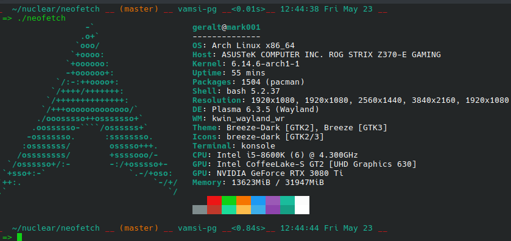

<h3 align="center"></h3>

A command-line system information tool written in bash 3.2+

Neofetch is a command-line system information tool written in `bash 3.2+`. Neofetch displays information about your operating system, software and hardware in an aesthetic and visually pleasing way.

The overall purpose of Neofetch is to be used in screen-shots of your system. Neofetch shows the information other people want to see. There are other tools available for proper system statistic/diagnostics.

The information by default is displayed alongside your operating system's logo. You can further configure Neofetch to instead use an image, a custom ASCII file, your wallpaper or nothing at all.

You can further configure Neofetch to display exactly what you want it to. Through the use of command-line flags and the configuration file you can change existing information outputs or add your own custom ones.

Neofetch supports almost 150 different operating systems. From Linux to Windows, all the way to more obscure operating systems like Minix, AIX and Haiku. If your favourite operating system is unsupported: Open up an issue and support will be added.

## Multi-Monitor Support

Neofetch now includes enhanced multi-monitor detection for **KDE Wayland** environments in linux. When running on KDE with Wayland, neofetch will automatically detect and display resolution information for all connected monitors.

**Features:**
- Detects all enabled monitors automatically
- Shows resolutions with optional refresh rates (`--refresh_rate on`)
- Tested on Arch Linux + KDE + Wayland setups
- Falls back to standard X11 detection methods when needed

**Requirements:** `kscreen-doctor` and `jq` (available in most Linux distributions)

### More: \[[Dependencies](https://github.com/dylanaraps/neofetch/wiki/Dependencies)\] \[[Installation](https://github.com/dylanaraps/neofetch/wiki/Installation)\] \[[Wiki](https://github.com/dylanaraps/neofetch/wiki)\]
